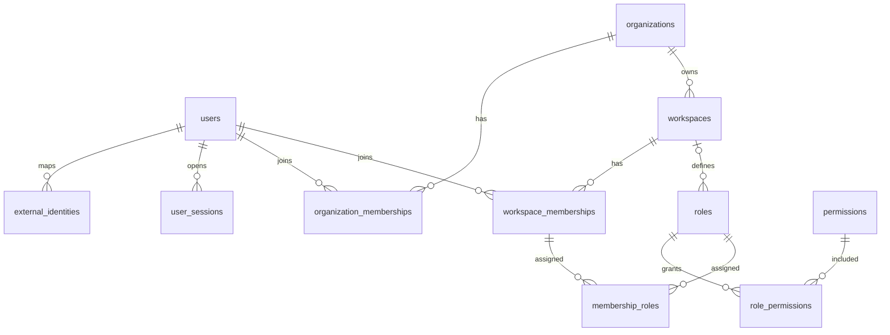
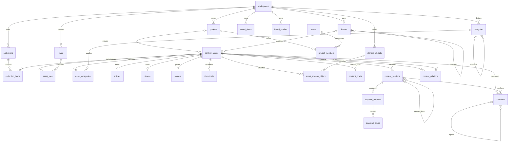
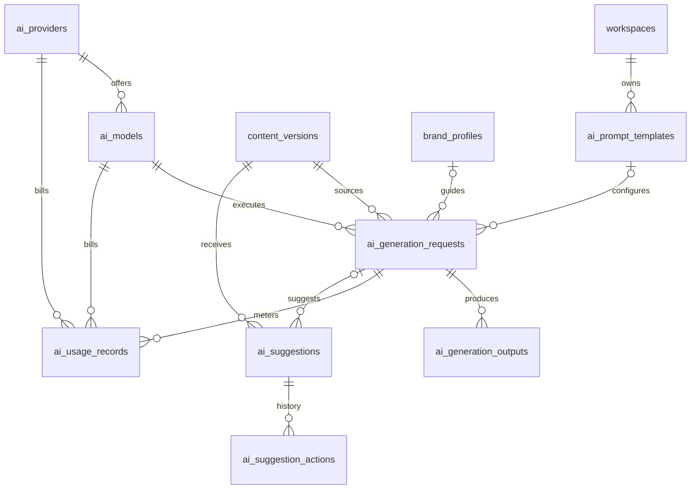
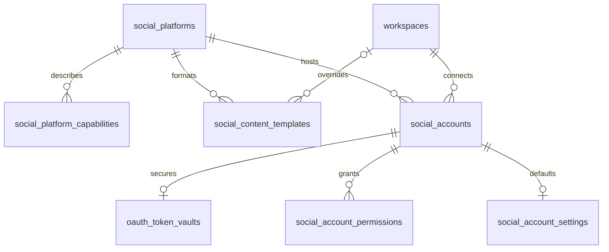
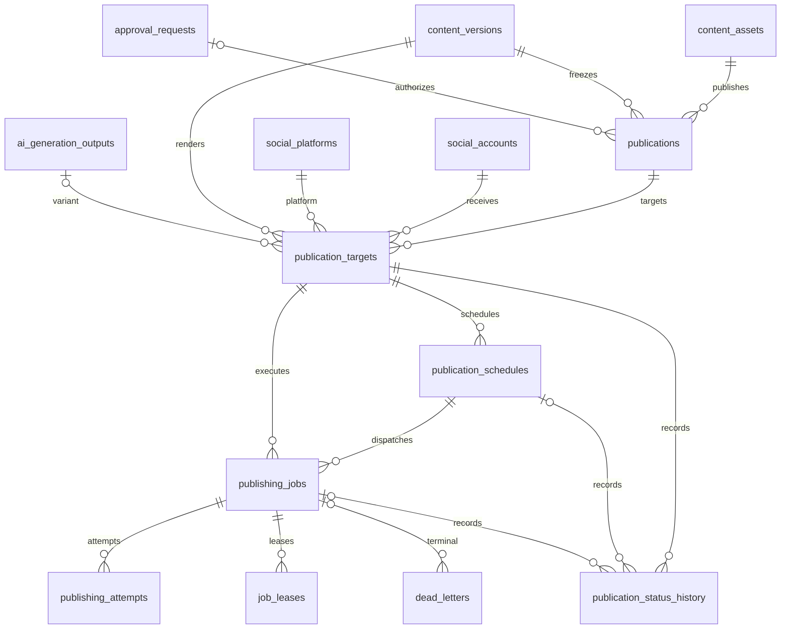
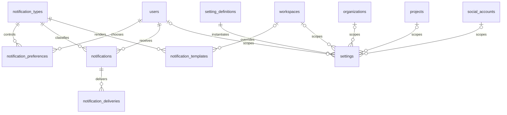
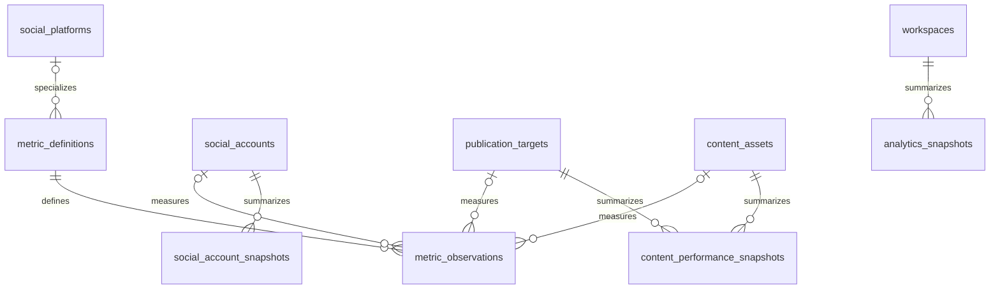
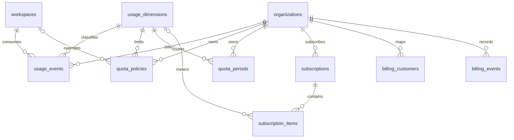
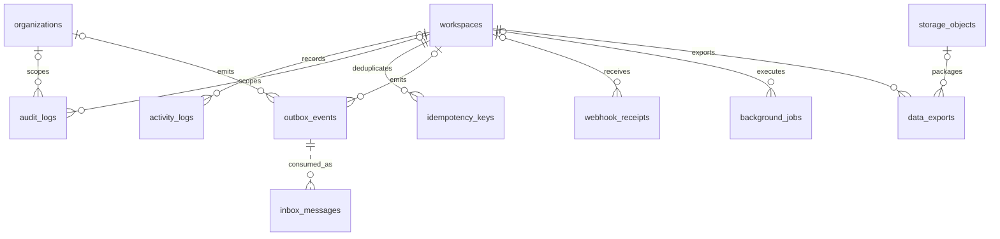

# Entity Relationship Diagrams

These bounded-context diagrams cover the authoritative **86-table** inventory. They emphasize ownership and principal relationships; every workspace-owned child also has the direct `workspace_id` relationship and composite tenant-safe FK described in `DATABASE_SCHEMA.md`. Every entity shown—business, operational, catalog, junction, immutable, or integration—contains `created_at`, `updated_at`, `created_by`, `updated_by`, `deleted_at`, and `version`; the six repeated columns are omitted from diagram boxes only for readability, never from the physical design.

## Identity and tenancy (11)

## Content, projects, collaboration, and storage (24)

## AI generation (8)

## Social accounts (7)

## Publishing and scheduling (8)

## Notifications and settings (7)

## Analytics (5)

## Usage, quota, subscriptions, and billing (8)

## Reliability, audit, and operations (8)

## Cross-module relationship summary

- Tenancy → every WS module: direct `workspace_id`; no transitive-only tenancy.
- Identity → universal audit: every table has all six audit columns; nullable `created_by`/`updated_by` supports global/system actors and user anonymization without erasing records.
- Content → AI: immutable `content_versions` are generation inputs; outputs can materialize new versions.
- Content → publishing: approved immutable versions feed `publications` and `publication_targets`.
- Social → publishing/analytics: accounts are targets and analytics sources; platforms remain row-extensible catalogs.
- Publishing → notifications/activity/audit: state events create user notifications and ordinary activity while material/security transitions also create append-only audit records. Append-only tables retain all six columns in a fixed immutable shape and reject ordinary mutation.
- AI/publishing/storage → usage/billing: immutable `usage_events` normalize metered consumption and retain the same universal six audit columns.
- All transactional modules → outbox/inbox: state and event persist atomically; consumers deduplicate.

Count reconciliation: 11 + 24 + 8 + 7 + 8 + 5 + 2 + 5 + 8 + 8 = **86 tables**.
