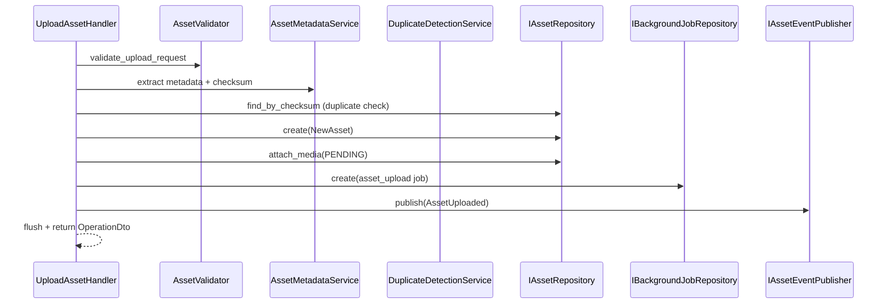

# Asset Upload

## Purpose

Upload creates a new content asset aggregate, attaches pending media metadata, enqueues asynchronous blob ingestion and virus scanning, and raises an `AssetUploaded` domain event within the same transaction.

## Flow



## Validation

Validation occurs in two layers:

### Business validation (`validators/asset_validator.py`)

1. **Filename** — base name only; no path segments.
2. **Extension** — must match asset type allowlist.
3. **MIME and size** — must match allowed pairs per asset type.
4. **Checksum** — optional SHA-256 verified against file bytes.

### Allowed media pairs

| Asset type            | MIME types                                             | Max size |
| --------------------- | ------------------------------------------------------ | -------- |
| `poster`, `thumbnail` | `image/jpeg`, `image/png`, `image/webp`                | 10 MiB   |
| `article`             | `text/plain`, `text/markdown`, `application/pdf`, DOCX | 25 MiB   |
| `video`               | `video/mp4`, `video/webm`, `video/quicktime`           | 2 GiB    |

### Duplicate detection

`DuplicateDetectionService` rejects uploads when an active asset with the same SHA-256 checksum and byte size already exists in the workspace (`REJECT_CHECKSUM` policy, default).

### Virus scan hook

`IVirusScanHook.validate_acceptance` is invoked after the asset aggregate is created. The default `NoOpVirusScanHook` defers scanning to the media worker. Custom implementations may reject obviously unsafe payloads synchronously.

## Metadata extraction

`AssetMetadataService` extracts immutable metadata at upload time:

- SHA-256 checksum (computed if not supplied)
- File extension
- Byte size and content type
- Image width/height (JPEG, PNG, WebP header parsing)

Extracted metadata is stored on the media record and never mutated after upload.

## Storage orchestration

Blob upload happens asynchronously via the `media` background queue. `AssetStorageService` resolves the target container and blob path using the documented naming strategy:

```text
{tenant-id}/{user-id}/{yyyy}/{mm}/{dd}/{asset-type}/{uuid}/{filename}
```

Container mapping:

| Asset type  | Container    |
| ----------- | ------------ |
| `poster`    | `posters`    |
| `article`   | `articles`   |
| `video`     | `videos`     |
| `thumbnail` | `thumbnails` |

The media worker uses `IObjectStoragePort.upload` to persist bytes. Handlers never call the Azure SDK directly.

## Idempotency

Upload requires an `Idempotency-Key`. The handler checks `IBackgroundJobRepository.get_by_idempotency_key` for an existing `asset_upload` job. Matching keys return the prior `OperationDto`. Mismatched resource IDs raise `IdempotencyConflictError`.

## Response

Upload returns `OperationDto` with `type=upload`, `status=queued`, and `resourceId` set to the new asset ID. The client polls or waits for scan completion before accessing download URLs.

## Replace vs upload

Replace follows the same validation and metadata extraction path but requires:

- Asset in `active` lifecycle status
- Matching `If-Match` version
- No checksum duplicate excluding the current asset

Replace raises `AssetReplaced` and queues an `asset_replace` media job.

## Related

- [Versioning](VERSIONING.md)
- [Storage upload flow](../../storage/UPLOAD_FLOW.md)
- [Validation rules](../../storage/VALIDATION_RULES.md)
