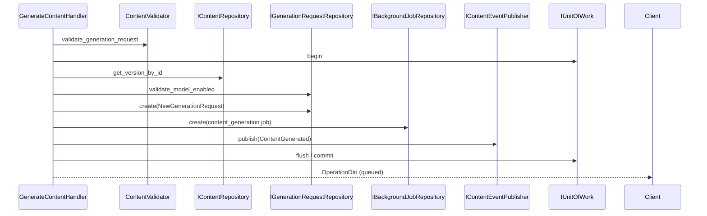

# Generation Flow

End-to-end flow for AI content generation within the application module.

## Synchronous acceptance (command handlers)

## Asynchronous completion (worker — out of module scope)

1. Worker leases `content_generation` job from AI queue.
2. Worker loads generation request and source version snapshot.
3. Worker calls `ContentGenerationService` → `AIGenerationPort.generate()`.
4. Worker persists immutable `AIGenerationOutput` candidates (one per platform when applicable).
5. Worker updates generation request status and background job state.
6. User approves output via `ApproveContentHandler`, which materializes a new `ContentVersion`.

## Regeneration

`RegenerateContentHandler` follows the same acceptance pattern with these differences:

- Validates existing content aggregate and source version relationship.
- Uses job type `content_regeneration`.
- Raises `ContentRegenerated` instead of `ContentGenerated`.
- Never modifies or deletes prior versions or outputs.

## Preview (synchronous, non-persisted)

`PreviewContentHandler`:

1. Validates generation inputs.
2. Loads source version detail for context.
3. Invokes `ContentGenerationService.preview()` which calls `AIGenerationPort` directly.
4. Returns `ContentPreviewResponse` without creating requests, jobs, or versions.

Preview is intended for low-volume validation only and remains subject to AI rate limits at the
delivery layer.

## Idempotency

Generate and regenerate commands require an idempotency key. Handlers resolve existing background
jobs through `IBackgroundJobRepository.get_by_idempotency_key` and return the mapped
`OperationDto` when the same key is replayed with an identical resource target.

## Failure handling

| Stage                         | Application error                                            |
| ----------------------------- | ------------------------------------------------------------ |
| Invalid inputs                | `GenerationValidationError`                                  |
| Missing version/content       | `ContentNotFoundError`, `ContentVersionNotFoundError`        |
| Disabled model                | `GenerationValidationError`                                  |
| Idempotency mismatch          | `IdempotencyConflictError`                                   |
| AI provider failure (preview) | Propagated `DependencyError` subclasses from AI port adapter |

Generation acceptance itself does not call the AI provider; provider failures surface in the worker
and are reflected on the returned `OperationDto` status once the job completes.
