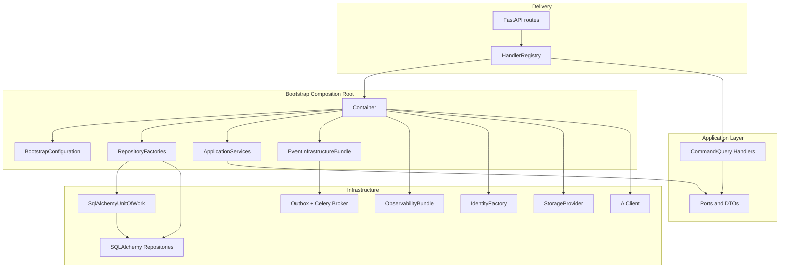

# Bootstrap Dependency Graph

## Overview

## Handler dependency pattern

Every mutating handler receives:

1. `unit_of_work_factory: Callable[[], IUnitOfWork]`
2. One or more `*_repository_factory: Callable[[IUnitOfWork], I*Repository]`
3. Optional ports (`AIGenerationPort`, `IObjectStoragePort`, event publishers, admin status ports)

Repository factories resolve the active SQLAlchemy session through `resolve_session(unit_of_work)`.

## Port adapters

| Application port        | Bootstrap adapter              | Infrastructure source          |
| ----------------------- | ------------------------------ | ------------------------------ |
| `AIGenerationPort`      | `AIGenerationPortAdapter`      | `AIClient`                     |
| `IObjectStoragePort`    | `ObjectStoragePortAdapter`     | `StorageProvider`              |
| `IProviderHealthPort`   | `CompositeProviderHealthPort`  | AI + storage + identity health |
| `ISystemStatusPort`     | `HealthBackedSystemStatusPort` | `HealthChecker`                |
| `IQueueStatusPort`      | `CeleryQueueStatusPort`        | Celery app                     |
| `IStorageStatusPort`    | `StorageBackedStatusPort`      | Storage health                 |
| `IScheduleTimeResolver` | `ZoneInfoScheduleTimeResolver` | `zoneinfo`                     |

## Event publishers

`EventInfrastructureBundle.publishers` exposes module-specific outbox publishers. Handlers that mutate state receive either:

- a shared publisher instance (`IAssetEventPublisher`), or
- `event_publisher_factory=lambda _uow: bundle.publishers.content` for UoW-scoped publish calls.

## Known gaps

These application ports still resolve to `UnwiredDependency` until infrastructure implementations land:

- `IBackgroundJobRepository`
- Search repositories (`ISavedSearchRepository`, `IRecentSearchRepository`, `ISearchSuggestionRepository`, `IPublicationSearchRepository`)

Handlers that require those repositories are registered but will raise at runtime if invoked before adapters exist.
