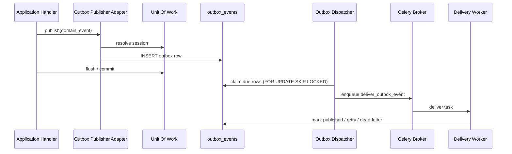

# Transactional Outbox Pattern

## Purpose

Cloud Content Hub AI persists integration events in the same PostgreSQL transaction as the business change that caused them. Handlers never publish directly to queues or external systems. Instead, they call module-specific event publisher ports (`IAssetEventPublisher`, `IContentEventPublisher`, and so on) which append rows to `outbox_events`.

## Flow

## Guarantees

- **Atomicity**: If the business transaction rolls back, no outbox row is committed.
- **At-least-once delivery**: Dispatchers and workers must be idempotent.
- **Ordering**: Events for one aggregate are ordered by `occurred_at`, then `id`.
- **Immutability**: Audit columns on `outbox_events` remain immutable; only dispatch fields (`published_at`, `attempt_count`, `available_at`, `last_error`) change.

## Scope rules

Each outbox row satisfies:

`workspace_id IS NOT NULL OR organization_id IS NOT NULL OR aggregate_type = 'global'`

Workspace-scoped module events populate `workspace_id`. Global administration events (for example maintenance mode) use `aggregate_type = 'global'`.

## Implementation

| Component          | Location                             |
| ------------------ | ------------------------------------ |
| Outbox writer      | `infrastructure/events/outbox.py`    |
| Publisher adapters | `infrastructure/events/publisher.py` |
| Event registry     | `infrastructure/events/registry.py`  |
| Composition root   | `infrastructure/events/factory.py`   |

Application handlers remain unchanged. They depend only on publisher ports and pass the active `IUnitOfWork`.

## Dead letters

Workspace-scoped events that exhaust retries are copied to `dead_letters` with `source_type = 'outbox'` and the outbox row is marked published to stop re-dispatch. Global events cannot be dead-lettered (the table requires `workspace_id`); they are marked with a terminal failure instead and logged for operations follow-up.

## Related documents

- [Event Publishing](EVENT_PUBLISHING.md)
- [Dispatcher](DISPATCHER.md)
- [Event Schema](EVENT_SCHEMA.md)
