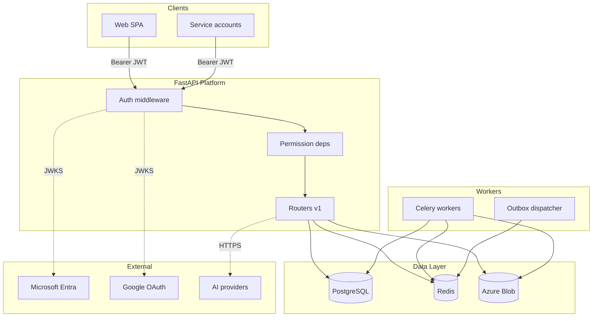

# Threat Model

Review date: 2026-08-02  
System: Cloud Content Hub AI Backend  
Methodology: STRIDE + trust boundary analysis

## System Context

## Trust Boundaries

| Boundary | Trust level | Controls |
|----------|-------------|----------|
| Internet → API | Untrusted | TLS, JWT verification, permission deps |
| API → PostgreSQL | Semi-trusted | Parameterized ORM, workspace_id scoping |
| API → Redis | Semi-trusted | Internal network, no auth in dev config |
| API → Azure Blob | Semi-trusted | Managed identity / SP, SAS least-privilege |
| Celery → PostgreSQL | Trusted internal | Wildcard worker permissions (risk) |
| Workers → Redis queue | Semi-trusted | No message signing (gap) |

## STRIDE Analysis

### Spoofing

| Threat | Mitigation | Residual risk |
|--------|------------|---------------|
| Forged JWT | Asymmetric signature, issuer/audience validation | Medium — no revocation in prod |
| OAuth code interception | PKCE, state/nonce | Low |
| Celery task spoofing | None | **High** — no task auth |

### Tampering

| Threat | Mitigation | Residual risk |
|--------|------------|---------------|
| Blob path traversal | Filename/blob validators | Low |
| SQL injection | SQLAlchemy parameterized queries | Low |
| Webhook payload tampering | Not implemented | **High** |

### Repudiation

| Threat | Mitigation | Residual risk |
|--------|------------|---------------|
| Admin action denial | Audit log schema exists | Medium — incomplete coverage |
| OAuth token use | Provider logs only | Medium |

### Information Disclosure

| Threat | Mitigation | Residual risk |
|--------|------------|---------------|
| Token in logs | Redaction pipeline | Low |
| Cross-tenant data access | Workspace scoping | **Medium** — no membership check |
| Signed URL leakage | Short TTL, HTTPS only | Low |
| Error message enumeration | Problem+json without secrets | Low |

### Denial of Service

| Threat | Mitigation | Residual risk |
|--------|------------|---------------|
| Large uploads | Size validators | Medium |
| AI cost abuse | Provider retry only | **High** — no HTTP rate limits |
| Worker retry storms | Bounded backoff, poison detection | Low |

### Elevation of Privilege

| Threat | Mitigation | Residual risk |
|--------|------------|---------------|
| Permission bypass via JWT claims | Route-level permission deps | Medium |
| Worker wildcard permissions | Queue isolation assumed | **Medium** — accepted R-004 |
| Admin route access | Role/permission deps | Medium — limited tests |

## Critical Assets

| Asset | Classification | Protection |
|-------|----------------|------------|
| JWT signing key | Critical secret | Env var, repr=False |
| OAuth client secrets | Critical secret | Settings, not logged |
| OAuth token vault | Confidential | Ciphertext / managed secret ref |
| User content blobs | Confidential | Private containers, SAS |
| Refresh tokens | Critical | JWT with jti; revocation partial |
| Database credentials | Critical | Env var; separate worker creds recommended |

## Attack Scenarios

### AS-01: Cross-workspace asset access

1. Attacker obtains valid JWT for workspace A
2. Attacker sends request with `X-Workspace-ID` for workspace B
3. If membership not checked, handler may return workspace B data

**Mitigation priority:** High (R-003)

### AS-02: Upload malware

1. Attacker uploads polyglot file passing MIME allowlist
2. NoOp virus scan allows content to become active

**Mitigation priority:** Medium (R-006)

### AS-03: AI cost exhaustion

1. Authenticated user floods generation endpoint
2. No rate limit; provider costs accrue

**Mitigation priority:** High (R-002)

### AS-04: Celery queue injection

1. Attacker publishes message to Redis broker
2. Worker executes with `*` permissions

**Mitigation priority:** Medium (network isolation + task signing)

## Risk Register Reference

Structured risks: `backend/src/cloud_content_hub/security/risk_register.py`  
Human-readable register: `HARDENING_CHECKLIST.md`
