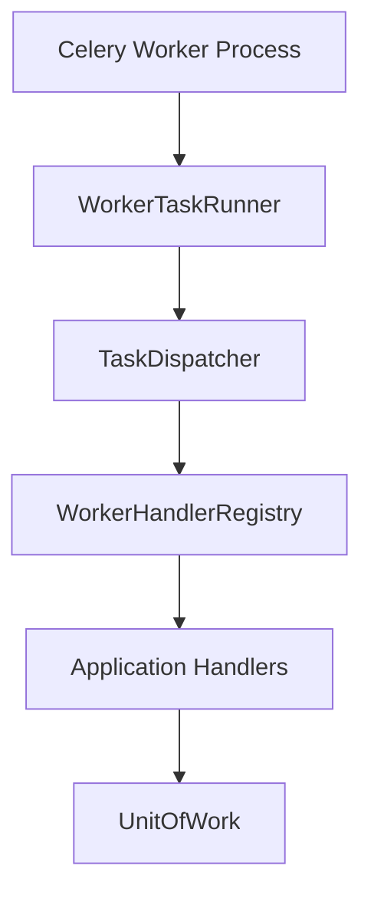

# Worker Architecture

Celery workers sit between Redis and the application layer, orchestrating asynchronous use cases without duplicating business logic.

## Layering



## Package Layout

```
workers/
├── celery_app.py      # Celery app + route registration
├── runtime.py         # Worker entry alias
├── factory.py         # WorkerBundle composition root
├── base.py            # Payload, runner, actor builder
├── dispatcher.py      # Handler registry and dispatch
├── retry.py           # Retry policy and dead-letter queue
├── routing.py         # Queue catalog
├── config.py          # Runtime and retry configuration
├── health.py          # Worker health service
├── exceptions.py      # Worker error types
└── tasks/             # Celery task definitions
```

## Composition

`create_worker_bundle(container)` lazily imports application handlers and registers one worker handler per task name. Outbox operations use `container.events` directly:

- Delivery: `container.events.delivery_service.deliver`
- Dispatch polling: `container.events.dispatcher.dispatch_batch`

## Observability

Every task execution:

1. Binds `request_id` and `correlation_id` through `core.context`
2. Creates an OpenTelemetry consumer span (`worker.{task_name}`)
3. Emits structured logs via structlog
4. Records Prometheus metrics on `worker_jobs_total` and `worker_job_duration_seconds`

## Security

Worker actors are system principals with wildcard permissions (`"*"`). Tasks must not log secrets, tokens, passwords, or PII.

## Health Checks

`WorkerHealthService` reuses `container.health_checker` and ensures an outbox lag probe is available through `create_outbox_health_check`.

## Design Constraints

- No direct SQLAlchemy usage in task modules
- No business logic in worker infrastructure
- All tasks must be idempotent and safe to retry
- Handler wiring stays inside `factory.py` with lazy imports
