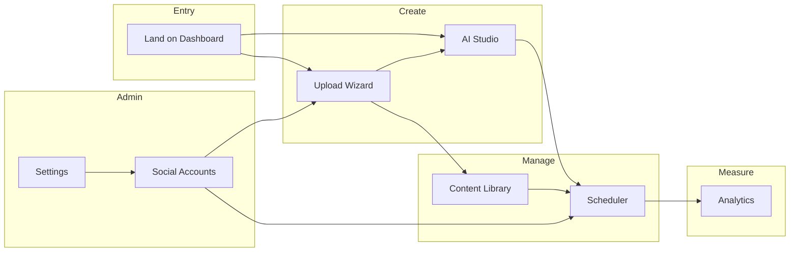

# Cloud Content Hub AI — User Journey Report

**Document type:** Journey-level UX findings  
**Companion to:** [UX_AUDIT.md](./UX_AUDIT.md)  
**Date:** August 2, 2026

---

## Journey Map Overview

---

## 1. Dashboard

**Route:** `/dashboard`  
**User goal:** Understand workspace health, see what needs attention, jump to next action.

### Journey steps

1. User lands after `/` redirect.
2. Greeting header with workspace health summary and primary CTA “Create content” → Upload.
3. Four metric cards show publishing/engagement/storage signals.
4. AI suggestions panel and publishing calendar panel side-by-side (desktop).
5. Recent content table with status badges.
6. Bottom modules (storage, connected accounts, activity).

### Findings

| Aspect                 | Rating      | Detail                                                                         |
| ---------------------- | ----------- | ------------------------------------------------------------------------------ |
| Clarity of next action | ✅ Good     | Primary CTA and quick-action chips (Upload, AI, Schedule, Connect) are visible |
| Scannability           | ✅ Good     | Metric cards, panels, and table follow predictable hierarchy                   |
| Deep linking           | ⚠️ Weak     | Table “View” links to library root, not item detail                            |
| Empty workspace        | ⚠️ Untested | Mock data always present; empty-state behavior for new tenants unclear         |
| Calendar confusion     | ⚠️ Risk     | Publishing calendar panel may imply separate Calendar nav item is ready        |

### Friction

- Quick actions duplicate header Create menu without guidance on which path to choose.
- AI suggestions panel lacks explicit “Act on this” vs “Dismiss” affordances in reviewed structure.
- No onboarding checklist for first-time users.

### Recommendations

- Link recent content rows to library preview (`?id=` or drawer).
- Add dismissible “Getting started” checklist when workspace has zero content.
- Clarify relationship between dashboard calendar widget and Scheduler.

---

## 2. Content Library

**Route:** `/content-library`  
**User goal:** Find, filter, preview, and act on content assets.

### Journey steps

1. Header with upload CTA.
2. Desktop: left filter sidebar (All, Favorites, Drafts, etc.) with counts.
3. Toolbar: search, type/status/platform/date/sort filters, grid/list toggle, refresh.
4. Grid or list of items; select for bulk bar; click for preview panel.
5. Mobile: filters via left drawer.

### Findings

| Aspect           | Rating     | Detail                                               |
| ---------------- | ---------- | ---------------------------------------------------- |
| Search           | ✅ Good    | Wired to title, tag, platform, type                  |
| Filtering        | ✅ Good    | Sidebar + toolbar; filter-aware empty states         |
| Preview          | ✅ Good    | Dynamic preview panel on select                      |
| Bulk actions     | ❌ Broken  | Bar appears on selection; buttons non-functional     |
| Card actions     | ⚠️ Partial | Open works; Edit/Duplicate noop; Delete confirm noop |
| Discoverability  | ⚠️ Weak    | Desktop card actions hidden until hover              |
| Pagination       | ✅ Good    | Page size, count, prev/next                          |
| Refresh feedback | ✅ Good    | Spinner with aria status during refresh              |

### Friction

- User selects 10 items, clicks “Schedule”—nothing happens (trust erosion).
- Favorite toggle and preview button coexist in thumbnail area—acceptable but dense.
- Platform and date filters hidden at some breakpoints without inline explanation.

### Recommendations

- Implement or disable bulk actions with clear messaging.
- Always-visible action row or kebab menu on cards.
- Show active filter summary chip row with “Clear all.”

---

## 3. Upload Wizard

**Route:** `/upload`  
**User goal:** Create a project by uploading assets and configuring AI enrichment.

### Journey steps

1. Progress header shows step X of 8.
2. Mobile stepper / desktop sidebar lists: Project info → Poster → Article → Video → Thumbnail → AI settings → Review → Finish.
3. User completes each step; validation blocks forward jump to incomplete future steps.
4. Save draft, cancel (with exit guard if dirty), back/next navigation.
5. Finish: toast, then choices—Dashboard, another project, AI Studio.

### Findings

| Aspect               | Rating       | Detail                                            |
| -------------------- | ------------ | ------------------------------------------------- |
| Progress visibility  | ✅ Excellent | Sidebar checkmarks, live region step announcement |
| Validation           | ✅ Good      | Error summary, field focus, file rejection toasts |
| Data loss prevention | ✅ Excellent | beforeunload + exit dialog                        |
| Step length          | ⚠️ Moderate  | 8 steps may feel long for simple uploads          |
| Skip paths           | ✅ Good      | Video/thumbnail skip options supported in flow    |
| Success path         | ✅ Good      | Clear post-completion CTAs                        |
| Mobile               | ✅ Good      | Condensed stepper; sidebar hidden appropriately   |

### Friction

- Step 7 “Create project” disabled until all prior valid—user may not know which step failed without scanning sidebar.
- No explicit progress percentage or estimated time.
- Dynamic step loading shows skeleton—good—but may flash on slow networks.

### Recommendations

- On validation failure at review, scroll to first incomplete step in sidebar with highlight.
- Add optional “Express upload” path for poster+article only (future).
- Show draft restored banner when returning to saved draft.

---

## 4. AI Studio

**Route:** `/ai-studio`  
**User goal:** Generate and refine platform-specific content variants from master assets.

### Journey steps

1. Header: save draft, suggestions drawer, version history toggle.
2. Desktop: three columns—Assets | Workspace editor | Preview.
3. Mobile: tab switcher (Assets / Workspace / Preview).
4. Platform tabs within workspace; generate/regenerate/transform; approve/reject.
5. Character limit bar; settings panel; version compare.

### Findings

| Aspect           | Rating       | Detail                                                         |
| ---------------- | ------------ | -------------------------------------------------------------- |
| Layout           | ✅ Good      | Mirrors “create once, adapt visibly” product promise           |
| Loading feedback | ✅ Excellent | Phase-specific overlay and live region                         |
| Empty states     | ✅ Good      | Variants for no content, no response, no preview               |
| Mobile           | ⚠️ Moderate  | Single-panel view requires tab switching; easy to miss preview |
| Version history  | ✅ Good      | Compare and restore flows present                              |
| Save feedback    | ✅ Good      | Toast on draft save; header shows last saved                   |

### Friction

- New user arriving without upload may not know to open Assets panel first on mobile.
- Suggestions drawer is discoverable only via header button—no inline prompt when editor empty.
- Undo/redo availability not obvious until user edits.

### Recommendations

- Default mobile tab to Workspace but show banner “Preview your post” when content exists.
- Inline empty workspace CTA linking to Upload Wizard.
- Keyboard shortcut hint for undo (Ctrl+Z) in editor toolbar.

---

## 5. Scheduler

**Route:** `/scheduler`  
**User goal:** Queue, calendar-view, and manage scheduled publishing.

### Journey steps

1. Page header + analytics widget + notifications + conflict alerts.
2. Toolbar: view mode (month/week/day/agenda), filters, timezone, navigation, refresh.
3. Three panels: Queue | Calendar | Details (desktop); tabs on mobile.
4. Select post → details with edit, duplicate, cancel, delete, publish now.
5. FAB (+) opens quick schedule dialog; drag-drop reschedule on calendar.

### Findings

| Aspect                | Rating       | Detail                                     |
| --------------------- | ------------ | ------------------------------------------ |
| Situational awareness | ✅ Excellent | Conflicts, notifications, mini analytics   |
| Empty states          | ✅ Good      | Search no-results vs no-selection variants |
| Selection model       | ✅ Good      | Queue and calendar sync selection          |
| Quick create          | ✅ Good      | FAB + dialog always available              |
| Calendar views        | ✅ Good      | Month/week/day/agenda implemented here     |
| Keyboard/drag         | ⚠️ Weak      | Drag reorder without keyboard alternative  |
| Mobile                | ✅ Good      | Tab panels; FAB for create                 |

### Friction

- **Calendar nav item** (`/calendar`) duplicates this journey but shows placeholder—users may never reach this fully built scheduler.
- Filter empty state replaces entire workspace—user loses queue/calendar context when search fails.
- Destructive actions in details panel lack secondary confirmation (delete/cancel)—rely on immediate execution + toast.

### Recommendations

- Redirect Calendar nav to Scheduler or remove until editorial calendar is distinct.
- Inline no-results in queue/calendar panels instead of full-page empty.
- Confirm cancel/delete with dialog for irreversible actions.

---

## 6. Analytics

**Route:** `/analytics`  
**User goal:** Measure performance, compare platforms, act on insights.

### Journey steps

1. Page header.
2. Filters: date range, platform, search (UI only), refresh.
3. Summary metric cards.
4. Charts: publishing trend, engagement, reach, AI usage.
5. Performance sections + top/worst posts + insights panel.

### Findings

| Aspect              | Rating        | Detail                                         |
| ------------------- | ------------- | ---------------------------------------------- |
| Filter bar          | ⚠️ Partial    | Date and platform work; search not wired       |
| Refresh UX          | ✅ Good       | Skeleton cards during 500ms refresh simulation |
| Data density        | ✅ Good       | Summary + charts + tables + insights           |
| Custom range        | ⚠️ Misleading | Label exists; only mock 30-day helper text     |
| Insights panel      | ✅ Good       | Actionable copy with platform context          |
| Chart accessibility | ⚠️ Moderate   | Visual-first; table fallback not exposed in UI |

### Friction

- User typing in search box sees no change—appears broken.
- Long page scroll without section jump nav (unlike Settings).
- No export or share reporting action.

### Recommendations

- Wire search to top posts table at minimum.
- Add sticky section nav or “Back to top.”
- Disable custom range until date picker ships.

---

## 7. Social Accounts

**Route:** `/social-accounts`  
**User goal:** Connect platforms, monitor health, manage publishing toggles.

### Journey steps

1. Toolbar: search, status filter, connect button, refresh.
2. Overview cards (connected, issues, etc.).
3. Account grid + activity timeline.
4. Connect dialog → platform list → mock OAuth toast.
5. Account details drawer for settings/disconnect/reconnect.

### Findings

| Aspect           | Rating  | Detail                                                  |
| ---------------- | ------- | ------------------------------------------------------- |
| Empty state      | ✅ Good | CTA to connect when zero accounts                       |
| Search/filter    | ✅ Good | Filter-aware empty message                              |
| Overview metrics | ✅ Good | Skeleton on refresh                                     |
| Connect flow     | ⚠️ Mock | Single-step dialog; no OAuth progress or error recovery |
| Account actions  | ✅ Good | Refresh, reconnect, disconnect with toasts              |
| Drawer details   | ✅ Good | Settings update with confirmation toast                 |

### Friction

- “Coming soon” platforms in grid may frustrate if not visually distinct from connectable ones.
- Disconnect is immediate—no confirmation despite publishing impact.
- Activity timeline on desktop only in xl layout—mobile users miss history.

### Recommendations

- Confirmation before disconnect with “scheduled posts affected” count.
- Clear visual separation for coming-soon platforms.
- Collapsible activity section on mobile.

---

## 8. Settings

**Route:** `/settings`  
**User goal:** Configure profile, workspace, integrations, and security.

### Journey steps

1. Page header.
2. Sticky section nav (desktop) / horizontal scroll (mobile).
3. Sections: Profile, Appearance, Notifications, AI Providers, Storage, Publishing, Security, API Keys, Danger Zone.
4. Per-section forms with save/reset; danger actions use confirmation dialogs.

### Findings

| Aspect              | Rating       | Detail                                     |
| ------------------- | ------------ | ------------------------------------------ |
| Section navigation  | ✅ Excellent | Anchors + scroll-spy active state          |
| Form validation     | ✅ Good      | Profile name required with inline error    |
| Save feedback       | ✅ Good      | Toast on successful save                   |
| Danger zone         | ✅ Excellent | Confirmation dialogs with consequence copy |
| Unsaved changes     | ❌ Missing   | No guard when leaving page mid-edit        |
| Profile photo       | ⚠️ Partial   | Upload button present; no flow attached    |
| API keys / security | ✅ Present   | Sections exist for enterprise expectations |

### Friction

- Long scroll—users may not discover bottom sections (Danger Zone).
- Reset on profile only resets full name field—not all fields.
- Appearance theme toggle also in header—two entry points (acceptable if synchronized).

### Recommendations

- “Unsaved changes” banner when any section dirty.
- Profile reset restores all profile fields.
- Optional collapse per section to reduce scroll fatigue.

---

## Cross-Journey Observations

### Navigation journeys

| Journey           | Entry points                                         | Exit / next step   |
| ----------------- | ---------------------------------------------------- | ------------------ |
| Create content    | Dashboard CTA, Create menu, sidebar Upload           | AI Studio, Library |
| Generate variants | Dashboard chip, Create menu, Upload finish           | Scheduler          |
| Schedule publish  | Dashboard chip, Library card, Scheduler FAB          | Analytics          |
| Connect platform  | Dashboard chip, Social Accounts, Settings Publishing | Upload, Scheduler  |
| Administer        | User menu → Settings                                 | —                  |

### Global shell journeys

**Search (broken journey):**

1. User presses Cmd+K or clicks search.
2. Types query.
3. **Nothing happens** — no results, no navigation, no feedback.

**Notifications (broken journey):**

1. User sees unread dot.
2. Clicks bell.
3. **Nothing happens** — no panel or acknowledgment.

**Sign out:**

1. User menu → Sign out.
2. Client storage cleared silently—no goodbye or re-auth redirect (expected for mock).

---

## Journey Severity Summary

| Journey         | Severity   | Top issue                                 |
| --------------- | ---------- | ----------------------------------------- |
| Dashboard       | Low–Medium | Weak deep links; no onboarding            |
| Content Library | **High**   | Non-functional bulk and card actions      |
| Upload Wizard   | Low        | Long flow; otherwise strong               |
| AI Studio       | Low–Medium | Mobile panel discovery                    |
| Scheduler       | Medium     | Calendar nav duplication; filter empty UX |
| Analytics       | Medium     | Non-functional search                     |
| Social Accounts | Low–Medium | Mock connect; disconnect confirmation     |
| Settings        | Low        | Unsaved changes; long page                |
| Global shell    | **High**   | Search and notifications non-functional   |

---

## Appendix: Route Readiness

| Route              | UX readiness  | Notes                        |
| ------------------ | ------------- | ---------------------------- |
| `/dashboard`       | Ready         | Minor link/onboarding gaps   |
| `/content-library` | Partial       | Action completion required   |
| `/upload`          | Ready         | Best-in-app journey          |
| `/ai-studio`       | Ready         | Mobile tabs need hints       |
| `/scheduler`       | Ready         | Best calendar implementation |
| `/calendar`        | **Not ready** | Placeholder only             |
| `/analytics`       | Partial       | Search wiring needed         |
| `/social-accounts` | Ready         | Pending real OAuth           |
| `/settings`        | Ready         | Unsaved guard optional       |
